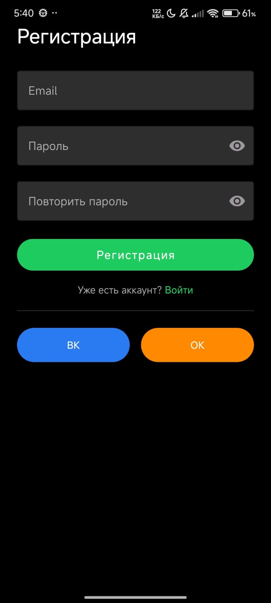

# Effective-Mobile

Demo Android application: a courses catalog with search, sorting, favorites, and basic navigation.  
Architecture — **Clean Architecture + MVVM**, DI with Hilt, reactive states via Coroutines/Flow.

---

## 🌟 Features
- Courses catalog with images, description, and publish date  
- Search by title (with debounce)  
- Sorting (newest/oldest)  
- Add/remove from Favorites  
- Separate Favorites screen  
- Profile screen (UI placeholder)  

---

## ⚙️ Tech Stack
- **Language:** Kotlin (KTX, coroutines, Flow)  
- **DI:** [Hilt](app/src/main/java/com/effective/effectivemobile/di/NetworkModule.kt)  
- **Networking:** [Retrofit](network/src/main/java/com/effective/core/network/api/CoursesApi.kt) + OkHttp, [Moshi](network/src/main/java/com/effective/core/network/di/NetworkModule.kt)  
- **Async:** [Kotlin Coroutines](app/src/main/java/com/effective/effectivemobile/ui/home/HomeViewModel.kt), structured concurrency, viewModelScope  
- **UI:** XML + ViewBinding, RecyclerView + DiffUtil + ListAdapter, Material Components  
- **Navigation:** Jetpack Navigation (single-activity)  
- **Local data:** [SharedPreferences](app/src/main/java/com/effective/effectivemobile/data/BookmarksPrefs.kt) (easily replaceable with DataStore/Room)  
- **Image loading:** [Glide](courses/src/main/java/com/effective/courses/ui/CoursesAdapter.kt)  
- **Code quality:** Detekt/ktlint, Gradle Kotlin DSL  

---

## 🏗 Architecture
Layered structure: `data → domain → presentation`

- **data** — DTOs, mappers, data sources (remote/local), repository implementations  
- **domain** — use cases, repository interfaces, business models (`Course`)  
- **presentation** — ViewModels (MVVM) + UiState (sealed), fragments, adapters  

Data flow:  
`Repository → ViewModel (Flow/suspend) → UI (render by UiState)`  

Principles: SOLID, pure interfaces, immutable models.

---

## 📦 Modules
- **app** — navigation, DI modules, screens, ViewModels  
- **courses** — UI components and models, adapters (no dependency on app)  
- **network** — Retrofit/Moshi/OkHttp configuration and API  
- **core** (optional) — utilities, base components, logging  

---

## 🔌 Dependency Injection
- `SingletonComponent`: Retrofit, OkHttp, Moshi, SharedPreferences  
- ViewModel injection with Hilt (repositories/use cases passed via constructor)  
- Presentation layer depends only on domain interfaces  

Example: [NetworkModule.kt](network/src/main/java/com/effective/core/network/di/NetworkModule.kt)  

---

## 🌐 Networking & Data
- Retrofit + Moshi (Kotlin-reflect adapter for data classes)  
- OkHttp: logging (debug), timeouts, interceptors  
- Errors mapped into `HomeUiState.Error` with safe messages  

---

## 🎨 UI & State
- `UiState` (Loading / Success / Empty / Error)  
- Center progress indicator for initial load, SwipeRefresh for reload  
- Search with 300ms debounce + IME_ACTION_SEARCH  
- Sorting by `publishDate`  
- Profile screen — UI placeholder with dummy buttons/toasts  

---

## ⭐️ Favorites
- Stored in SharedPreferences (set of IDs)  
- Abstraction: `BookmarkChecker` / `BookmarkToggler` (in courses module)  
- UI updates icons without screen reload  
- Removing from favorites instantly removes card from list  

---

## 🧭 Navigation
- Jetpack Navigation (single activity)  
- Graph: Home → Favorites → Profile  

---

## 📑 Code Quality
- Clean: no cyclic dependencies  
- Extensible: migration to DataStore/Room doesn’t affect interfaces  
- Testable: business logic in ViewModels/Repositories, thin UI layer  
- Reliable: strict state handling, fail-safe date parsing  
- Performance: DiffUtil/ListAdapter, lazy rendering, debounced search  

---

## ⚖️ Trade-offs
- SharedPreferences instead of Room/DataStore (for speed)  
- Client-side search by title; can be easily replaced with server query  

---

## 🔎 Key Files
- [HomeFragment](app/src/main/java/com/effective/effectivemobile/ui/home/HomeFragment.kt) — set-up, render(UiState), search debounce  
- [HomeViewModel](app/src/main/java/com/effective/effectivemobile/ui/home/HomeViewModel.kt) — sorting/filtering, state handling  
- [CoursesAdapter](courses/src/main/java/com/effective/courses/ui/CoursesAdapter.kt) — independent from app, uses Glide  
- [BookmarksPrefs](app/src/main/java/com/effective/effectivemobile/data/BookmarksPrefs.kt) — favorites storage  
- [FavoritesFragment](app/src/main/java/com/effective/effectivemobile/ui/favorites/FavoritesFragment.kt) — favorites list rendering  

---

## 📸 Screenshots

| Login | Home | Profile |
|-------|------|---------|
|  |  |  |

| Login | Favorites |
|-------|-----------|
|  |  |

---

## 🎥 Demo Animation


---

## 🚀 Build & Run
```bash
git clone https://github.com/username/effective-mobile.git
cd effective-mobile
./gradlew assembleDebug

