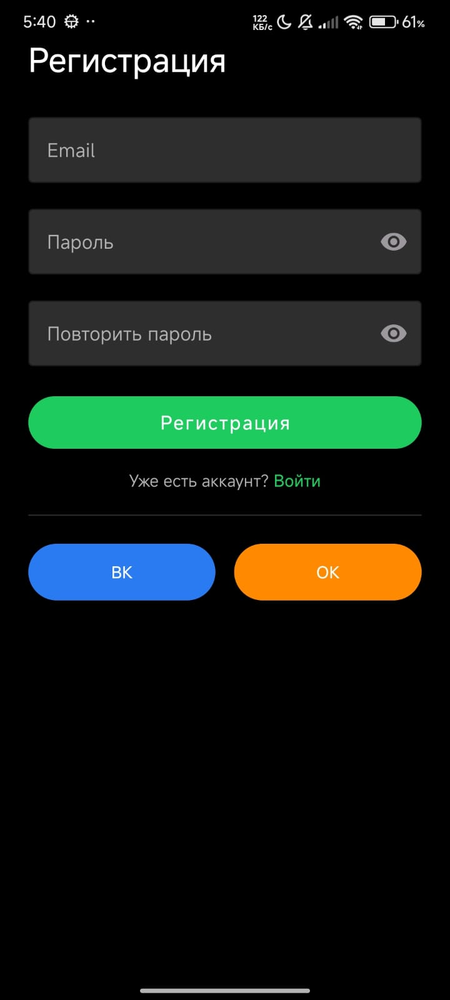

# Effective-Mobile

Учебно-демо Android-приложение: каталог курсов с поиском, сортировкой, избранным и базовой навигацией.  
Архитектура — **Clean Architecture + MVVM**, DI через Hilt, реактивные стейты на Coroutines/Flow.

---

## 🌟 Цели и функциональность
- Каталог курсов с картинками, описанием и датами  
- Поиск по заголовку (с дебаунсом)  
- Сортировка (новые/старые)  
- Добавление/удаление в «Избранное»  
- Экран «Избранное» с отдельным списком  
- Экран «Профиль» (UI-заглушка)  

---

## ⚙️ Технологический стек
- **Язык:** Kotlin (KTX, coroutines, Flow)  
- **DI:** [Hilt](app/src/main/java/com/effective/effectivemobile/di/NetworkModule.kt)  
- **Сеть:** [Retrofit](network/src/main/java/com/effective/core/network/api/CoursesApi.kt) + OkHttp, [Moshi](network/src/main/java/com/effective/core/network/di/NetworkModule.kt)  
- **Асинхронность:** [Kotlin Coroutines](app/src/main/java/com/effective/effectivemobile/ui/home/HomeViewModel.kt), structured concurrency, viewModelScope  
- **UI:** XML + ViewBinding, RecyclerView + DiffUtil + ListAdapter, Material Components  
- **Навигация:** Jetpack Navigation (single-activity)  
- **Локальные данные:** [SharedPreferences](app/src/main/java/com/effective/effectivemobile/data/BookmarksPrefs.kt) (заменяемы на DataStore/Room)  
- **Загрузка изображений:** [Glide](courses/src/main/java/com/effective/courses/ui/CoursesAdapter.kt)  
- **Качество кода:** Detekt/ktlint, Gradle Kotlin DSL  

---

## 🏗 Архитектура
Слоистая структура: `data → domain → presentation`

- **data** — DTO, мапперы, источники данных (remote/local), реализации репозиториев  
- **domain** — use-case, интерфейсы репозиториев, бизнес-модели (`Course`)  
- **presentation** — ViewModel (MVVM) + UiState (sealed), фрагменты, адаптеры  

Поток данных:  
`Repository → ViewModel (Flow/suspend) → UI (рендер по UiState)`  

Принципы: SOLID, чистые интерфейсы, неизменяемые модели.

---

## 📦 Модульная структура
- **app** — навигация, DI-модули, экраны, ViewModel’ы  
- **courses** — UI и модели каталога, адаптеры (без зависимостей на app)  
- **network** — Retrofit/Moshi/OkHttp-конфиг и API  
- **core** (опционально) — утилиты, base-компоненты, логгирование  

---

## 🔌 DI и конфигурация
- `SingletonComponent`: Retrofit, OkHttp, Moshi, SharedPreferences  
- ViewModel-инжект через Hilt (репозитории и use-case попадают через конструктор)  
- Вью-слой зависит только от интерфейсов `domain`  

Пример: [NetworkModule.kt](network/src/main/java/com/effective/core/network/di/NetworkModule.kt)  

---

## 🌐 Сеть и данные
- Retrofit + Moshi (Kotlin-reflect адаптер для data-классов)  
- OkHttp: логирование (debug), таймауты, перехватчики  
- Ошибки маппятся в `HomeUiState.Error`  

---

## 🎨 UI и состояние
- `UiState` (Loading / Success / Empty / Error)  
- Центр-прогресс при первичной загрузке, SwipeRefresh для обновления  
- Поиск: дебаунс 300 мс + IME_ACTION_SEARCH  
- Сортировка по `publishDate`  
- Экран «Профиль» — UI-заглушка с кнопками-тостами  

---

## ⭐️ Избранное
- Хранение: SharedPreferences (сет id’шников)  
- Абстракция: `BookmarkChecker` / `BookmarkToggler` (в модуле courses)  
- UI обновляет иконку без перезагрузки  
- Удаление из избранного — сразу убирает карточку  

---

## 🧭 Навигация
- Jetpack Navigation (single activity)  
- Graph: Home → Favorites → Profile  

---

## 📑 Качество кода
- Чистота: без циклических зависимостей  
- Расширяемость: миграция на DataStore/Room прозрачна для интерфейсов  
- Тестируемость: бизнес-логика в ViewModel/репозиториях, UI — тонкий слой  
- Надёжность: строгая обработка состояний, fail-safe парсинг дат  
- Производительность: DiffUtil/ListAdapter, lazy-рендер, дебаунс поиска  

---

## ⚖️ Трейд-оффы
- SharedPreferences вместо Room/DataStore (для скорости)  
- Поиск на клиенте, при необходимости легко вынести на сервер  

---

## 🔎 Файлы, на которые стоит смотреть
- [HomeFragment](app/src/main/java/com/effective/effectivemobile/ui/home/HomeFragment.kt) — set-up, render(UiState), дебаунс поиска  
- [HomeViewModel](app/src/main/java/com/effective/effectivemobile/ui/home/HomeViewModel.kt) — сортировка/фильтрация, работа со стейтом  
- [CoursesAdapter](courses/src/main/java/com/effective/courses/ui/CoursesAdapter.kt) — независим от app, использует Glide  
- [BookmarksPrefs](app/src/main/java/com/effective/effectivemobile/data/BookmarksPrefs.kt) — хранилище избранного  
- [FavoritesFragment](app/src/main/java/com/effective/effectivemobile/ui/favorites/FavoritesFragment.kt) — рендер списка избранного  

---

---

## 📸 Скриншоты

| Login | Home | Profile |
|------|---------|-----------|
|  |  |  |

| Login | Favorite |
|-------|---------|
|  |  |


---

## 🎥 Демо-анимация


## 🚀 Сборка и запуск
```bash
git clone https://github.com/username/effective-mobile.git
cd effective-mobile
./gradlew assembleDebug
